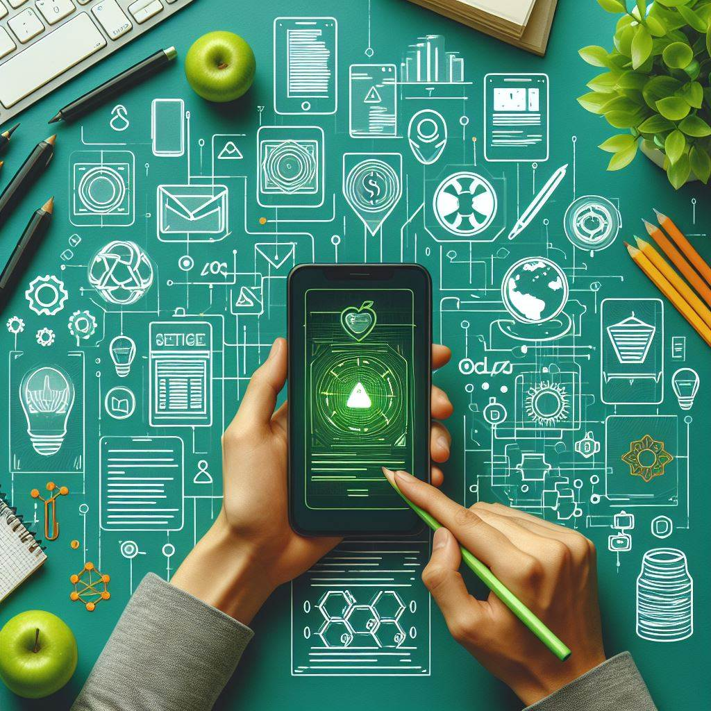
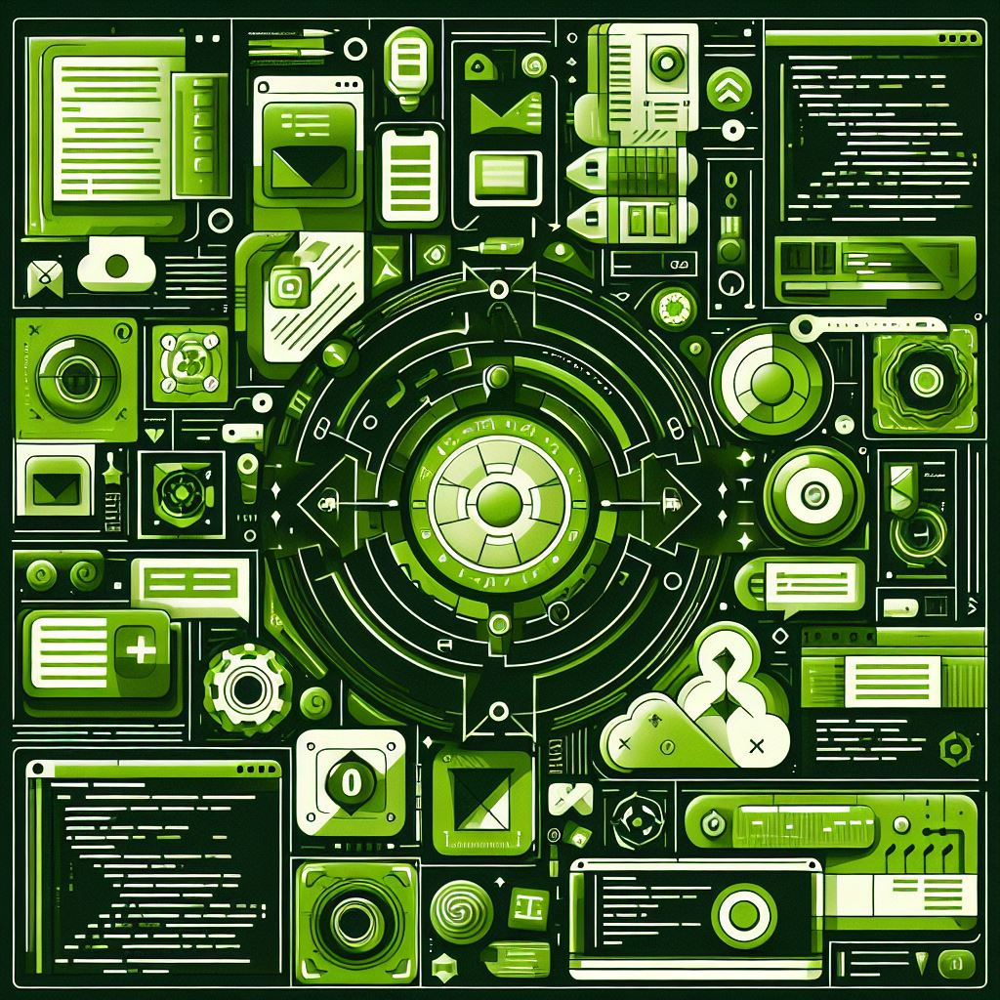
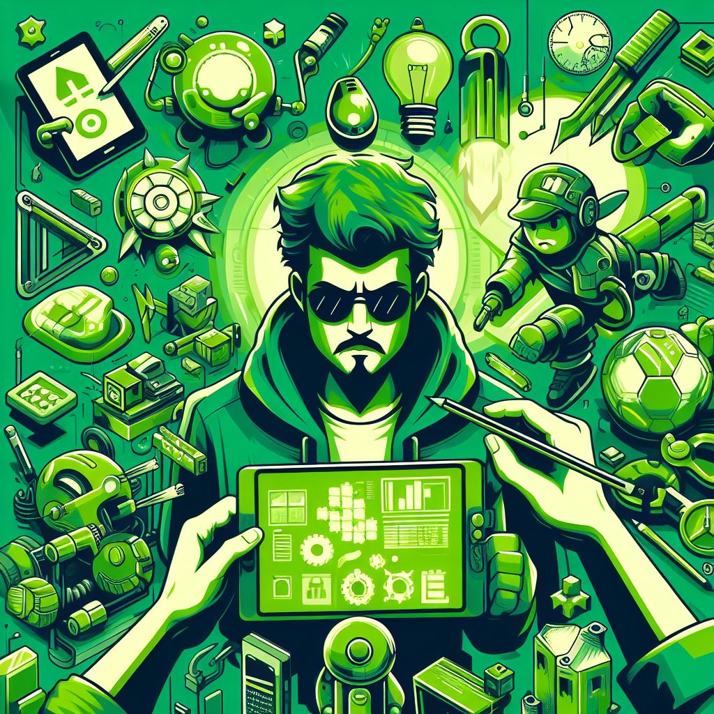
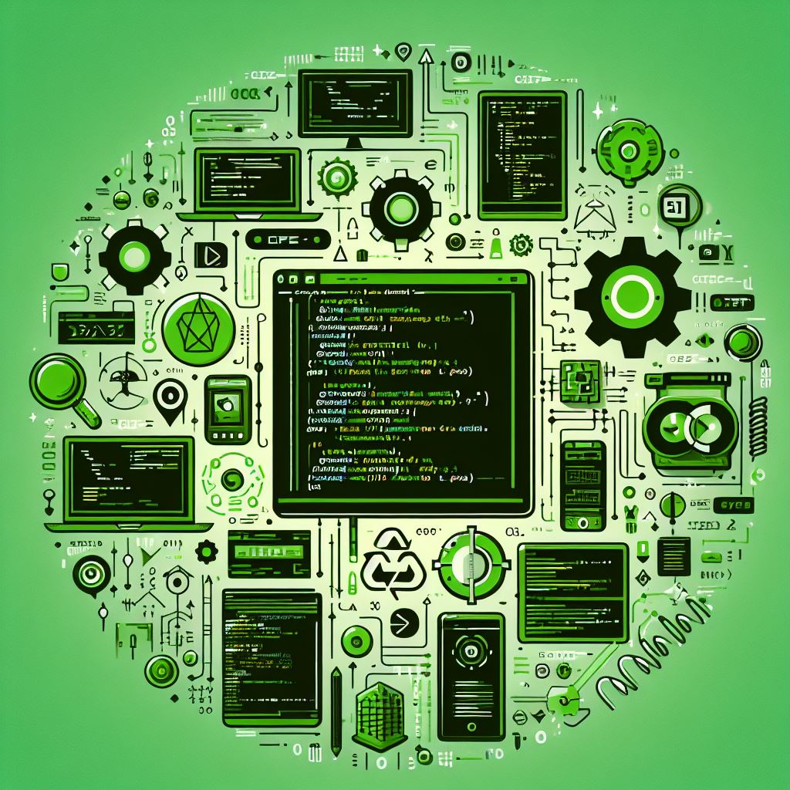

# Tech Society App


Welcome to the Tech Society App! This application serves as a comprehensive platform for all tech enthusiasts, offering a wide range of features tailored to foster collaboration, showcase projects, manage events, and provide valuable resources.

## Features

### 1. Dynamic Forms

Easily create customizable forms using our dynamic form builder. Whether it's for project submissions, event registrations, or feedback collection, our tool simplifies the process.

### 2. Project Showcase

Showcase your innovative projects with detailed descriptions, images, tags, and status updates. Share your creations with the community and gather feedback to improve.

### 3. Event Management

Stay informed about upcoming events, workshops, and competitions. Register for events, view schedules, and access past event certificates directly from the app.

### 4. Gallery

Explore our gallery filled with captivating images from past events, hackathons, and project showcases. Get inspired by the creativity and innovation of our community members.

### 5. Community Collaboration

Connect with like-minded individuals, join teams working on exciting projects, and contribute your skills and expertise to make a meaningful impact.

## Screenshots

| Profile Page | Home Page | Admin Panel | App Development Domain Page |
|--------------|-----------|-------------|-----------------------------|
|  |  |  |  |

The profile page allows users to manage their account settings, view their contributions, and connect with other members of the community.

The home page serves as the central hub of the app, providing quick access to featured projects, upcoming events, and important announcements.

Administrators have access to a dedicated admin panel for managing users, content, and app settings. From here, they can moderate submissions, analyze data, and oversee the community's activities.

Explore the App Development domain page to discover projects, resources, and events related to mobile app development. Stay updated with the latest tools, frameworks, and best practices in the industry.


Here are some visually stunning images representing each technology domain:

Here are some visually stunning images representing each technology domain:

- **AI/ML**
  <kbd></kbd>

- **App Development**
  <kbd></kbd>

- **Blockchain**
  <kbd></kbd>

- **Core Development**
  <kbd></kbd>

- **Game Development**
  <kbd></kbd>

- **UI/UX Design**
  <kbd></kbd>

- **Web Development**
  <kbd></kbd>


## Get Started

1. **Clone the Repository:**
   ```bash
   git clone https://github.com/Vaibhavyadav350/GFGKIIT/
