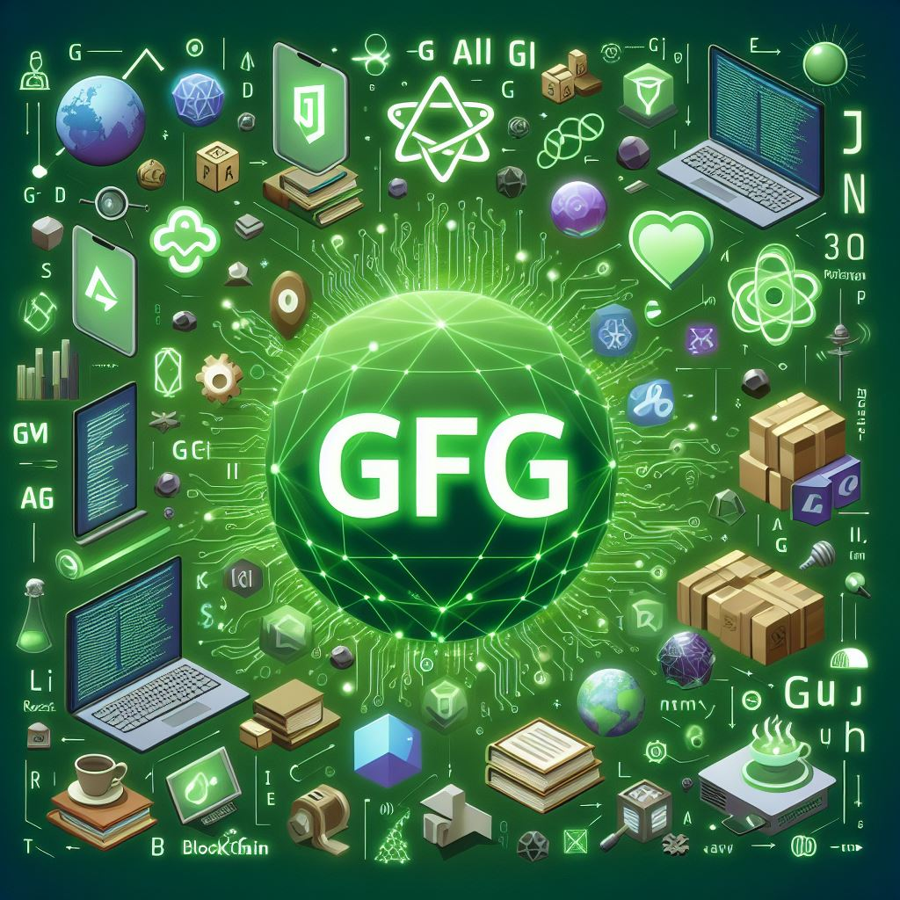
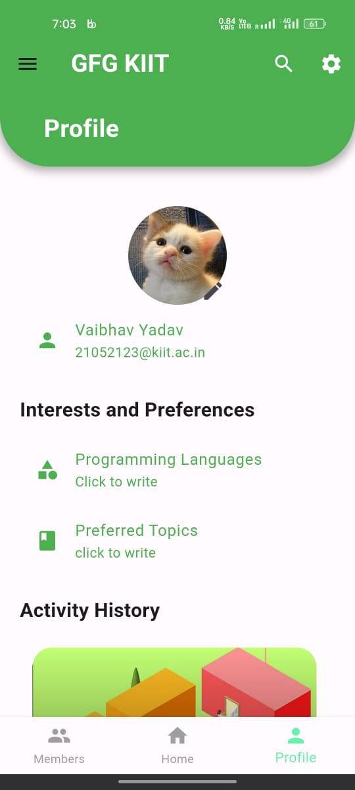
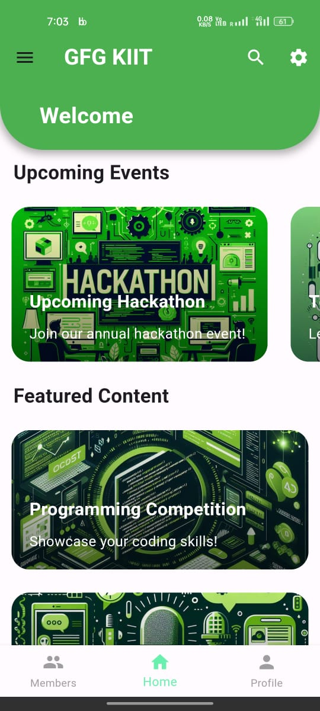
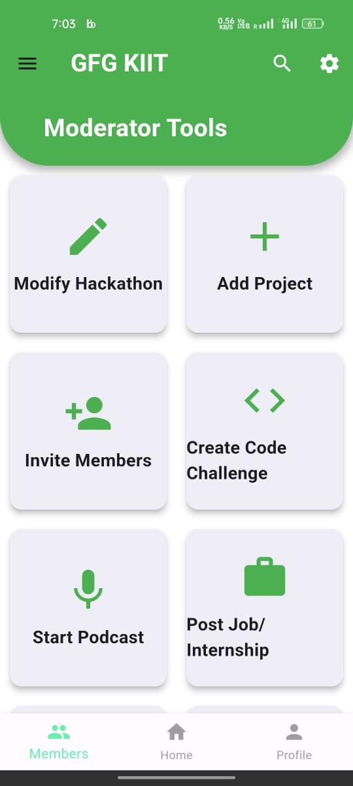
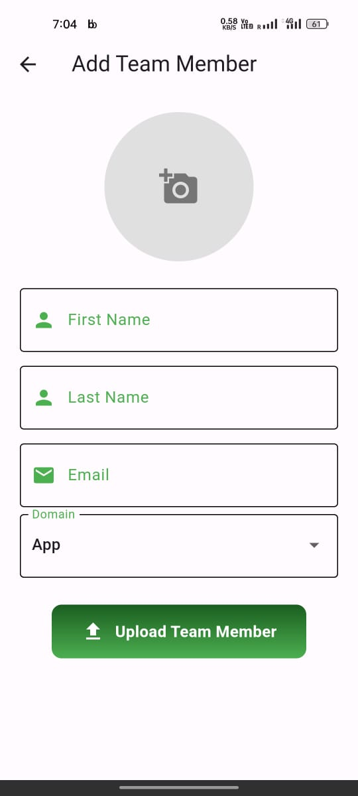
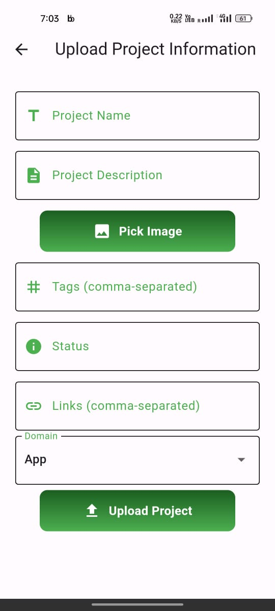
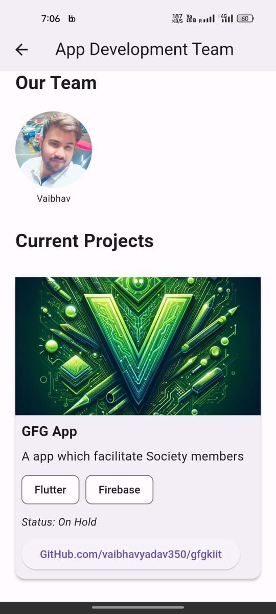

# GFG KIIT App

<p align="center">
 
</p>

- 
- 
- 

Welcome to the GFG Society App! This application serves as a comprehensive platform for all tech enthusiasts, offering a wide range of features tailored to foster collaboration, showcase projects, manage events, and provide valuable resources.

## Features

### 1. Dynamic Forms

Easily create customizable forms using our dynamic form builder. Whether it's for project submissions, event registrations, or feedback collection, our tool simplifies the process.

### 2. Project Showcase

Showcase your innovative projects with detailed descriptions, images, tags, and status updates. Share your creations with the community and gather feedback to improve.

### 3. Event Management

Stay informed about upcoming events, workshops, and competitions. Register for events, view schedules, and access past event certificates directly from the app.

### 4. Gallery

Explore our gallery filled with captivating images from past events, hackathons, and project showcases. Get inspired by the creativity and innovation of our community members.

### 5. Community Collaboration

Connect with like-minded individuals, join teams working on exciting projects, and contribute your skills and expertise to make a meaningful impact.

## Main Pages

### Profile Page

The profile page allows users to manage their account settings, view their contributions, and connect with other members of the community.

### Home Page

The home page serves as the central hub of the app, providing quick access to featured projects, upcoming events, and important announcements.

### Admin Panel

Administrators have access to a dedicated admin panel for managing users, content, and app settings. From here, they can moderate submissions, analyze data, and oversee the community's activities.

### Domain Pages
Here are dedicated pages for each technology domain, providing detailed information, resources, and updates related to AI/ML, app development, blockchain, core development, game development, UI/UX design, and web development.

## 🛠️ Crafted With


## Screenshots

| Profile Page | Home Page | Admin Panel |
|--------------|-----------|-------------|
|  |  |  |


| Add Member | Add Project | Domains Page |
|--------------|-----------|-------------|
|  |  |  |


### Here are some visually stunning images representing each technology domain:

<kbd></kbd><kbd></kbd><kbd></kbd><kbd></kbd><kbd></kbd><kbd></kbd><kbd></kbd><kbd></kbd>

## Get Started

1. **Clone the Repository:**
   ```bash
   git clone https://github.com/Vaibhavyadav350/GFGKIIT.git
2. **Install Dependencies:**
   ```bash
   cd GFGKIIT
   flutter pub get
3. **Run the App:**
   ```bash
   flutter run

### Contributing
We welcome contributions from all developers! If you have any ideas for new features or improvements, feel free to open an issue or submit a pull request.

## 🌐 Explore & Engage

* 🔗 [Vaibhavyadav350's GitHub](https://github.com/Vaibhavyadav350)
* 🌟 [Vaibhav on LinkedIn](https://linkedin.com/in/vaibhav-yadav-b20045213/)

### Credits
This app was developed with love by the GFG Society team. Special thanks to all our contributors and sponsors for their support!
